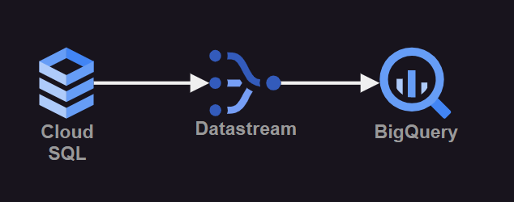

# gcp-bigquery

Data sync via CDC from GCP Cloud SQL to Big Query using Datastream.



Make sure to login with gcloud:

```
gcloud auth application-default login
```

Create the `.auto.tfvars` parameter:

```hcl
project_id    = "<project_id>"
region        = "us-central1"
database_tier = "db-f1-micro"
```

Create the database:

```sh
terraform init
terraform apply -auto-approve
```

Connect to the database and execute execute the SQL commands in the `database.sql` file.

This database already has automated backups and point-in-time recovery enabled.

Now in the GCP console [create a stream in Datastream](https://console.cloud.google.com/datastream/streams) that sends the changes in the database to BigQuery.

Data should be available in the BigQuery dashboard for queries.
